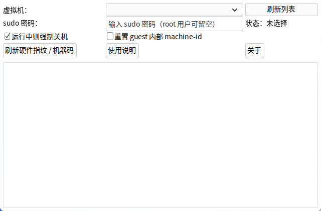

# kvm-fpr — KVM 虚拟机硬件指纹刷新工具

一个基于 **C 语言 + NAppGUI 开源图形库** 的图形化工具，用于刷新现有 KVM 虚拟机的
**硬件指纹与机器码**：为虚拟机生成**全新的 UUID、网卡 MAC 地址、SMBIOS 序列号**，
并可选重置 guest 内部 **machine-id（机器码）**，让虚拟机以"全新机器"的身份呈现给系统和应用。

> 纯开源实现：GUI 使用 NAppGUI（MIT License，与 GPLv3 兼容），本项目源码以 GPLv3 发布，
> 后端调用系统 libvirt/virsh，无任何闭源组件，无法律风险。



## ✨ 功能特性

| 功能 | 说明 |
|---|---|
| 虚拟机列表 | 一键列出本机 libvirt 管理的全部 KVM 虚拟机 |
| 刷新硬件指纹 | 生成全新 UUID、所有网卡 MAC、SMBIOS 序列号/系统 UUID |
| 智能关机 | 运行中的虚拟机可选择优雅关机（`virsh shutdown`）或强制关机（`virsh destroy`） |
| 机器码重置 | 可选重置 guest 内部 `/etc/machine-id` 等机器码（需 `virt-customize`） |
| 自动备份 | 刷新前自动备份原始 XML 到 `~/kvm-fpr-backups/`，可随时恢复 |
| 保留自启 | 自动保留并恢复虚拟机的开机自启设置 |
| UEFI 支持 | 含 UEFI nvram 的虚拟机自动重建 nvram |

## 📦 下载安装

提供两种安装包（见 [Releases](../../releases)）：

### Debian / Deepin / Ubuntu（.deb）

```bash
sudo dpkg -i kvm-fpr_1.0.0_amd64.deb
```

### 任意发行版（.AppImage）

```bash
chmod +x kvm-fpr-1.0.0-x86_64.AppImage
./kvm-fpr-1.0.0-x86_64.AppImage
```

## 🚀 快速开始

1. 打开程序，点击 **「刷新列表」** 加载虚拟机；
2. 在下拉框中选择要刷新的虚拟机；
3. 输入 **sudo 密码**（root 用户可留空；程序需要 root 权限执行 `virsh define`）；
4. （可选）勾选 **「重置 guest 内部 machine-id」**；
5. 点击 **「刷新硬件指纹 / 机器码」**；
6. 日志区显示新旧 UUID / MAC 对比及备份路径，即刷新完成。

> ⚠️ 刷新过程会短暂 **关闭虚拟机**（自动或强制），请提前保存 guest 内的工作。

## 📚 文档

- [使用说明](docs/使用说明.md) — 详细操作手册
- [技术说明](docs/技术说明.md) — 架构、指纹生成原理与打包方法

## 🛠 从源码构建

详见 [技术说明 · 构建与打包](docs/技术说明.md)，或直接使用一键构建脚本：

```bash
./build.sh          # 自动获取 NAppGUI SDK、编译、生成 .deb 与 .AppImage
```

## 📄 许可证

本项目源码采用 [GNU GPLv3](LICENSE) 协议发布（SPDX: GPL-3.0-or-later）。
GUI 库 [NAppGUI](https://github.com/frang75/nappgui) 为 MIT 许可（与 GPLv3 兼容），
可放心用于商业与个人项目。

**作者信息**
- 作者：彭刚要
- 邮箱：pgy866@163.com | yaoying@yaoying.vip
- 主页：www.yaoying.vip
